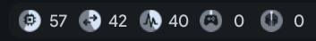

# GPU and NPU Monitoring for Intel Lunar Lake

Real-time GPU and NPU usage indicators for Hyprland with Quickshell, specifically designed for Intel Lunar Lake systems (Arc Graphics 130V/140V).



## Overview

This feature adds comprehensive GPU and NPU monitoring to the End-4 dots-hyprland configuration. It displays real-time resource usage indicators in multiple UI locations:

- **Top/Bottom Bar**: Compact circular indicators next to CPU, RAM, and Swap
- **Vertical Bar**: Stacked circular indicators for vertical layouts
- **Resource Popup**: Detailed hover tooltips with usage percentages
- **Overlay Widget**: Full-screen graphs with historical data

## What We Built

### GPU Monitoring
- **Method**: DRM cycle counters from `/proc/*/fdinfo/*` (same approach as Mission Center)
- **Engines Tracked**: 
  - Render/3D engine (RCS)
  - Video encode/decode engine (VCS)
  - Compute engine (CCS)
- **Calculation**: `Usage % = (active cycles / total cycles) × 100`
- **Supported Drivers**: 
  - Intel Xe (Lunar Lake native) via fdinfo
  - Intel i915 (older GPUs) via `intel_gpu_top`

### NPU Monitoring
- **Method**: sysfs power state tracking via `/sys/class/accel/accel0/`
- **States**: Active (100%) or Suspended (0%)
- **Note**: Basic power state monitoring - more sophisticated NPU metrics may become available as the platform matures

### UI Components
1. **Bar Indicators**: Circular progress indicators with Material Symbols icons
   - GPU: `stadia_controller` (🎮)
   - NPU: `neurology` (🧠)
2. **Popup Tooltips**: Show detailed stats on hover
3. **Overlay Graphs**: Full historical tracking with tabs for each resource
4. **Configuration**: Customizable thresholds and visibility settings

## Dependencies

### Required Packages

#### Arch Linux
```bash
sudo pacman -S intel-gpu-tools
```

#### Other Distributions
- **Fedora/RHEL**: `sudo dnf install igt-gpu-tools`
- **Ubuntu/Debian**: `sudo apt install intel-gpu-tools`

### System Requirements
- Intel Lunar Lake processor with Arc Graphics (or any Intel GPU Broadwell+)
- Linux kernel with Intel Xe or i915 driver
- Hyprland compositor
- Quickshell with Qt 6.10+

### Existing Configuration Dependencies
These should already be present if you're using the End-4 dots:
- Quickshell
- Material Symbols font
- Qt 6 QML modules

## Installation

### Method 1: From This Fork (Recommended)

1. **Clone or update this fork**:
```bash
cd ~/projects
git clone https://github.com/tslove923/dots-hyprland.git dots-hyprland-dev
cd dots-hyprland-dev
git checkout feature/gpu-npu-monitoring
```

2. **Install dependencies**:
```bash
sudo pacman -S intel-gpu-tools
```

3. **Sync to your live config**:
```bash
bash scripts/sync_and_test.sh gpu-npu
```

4. **Reload Quickshell**:
   - Press `Super+Shift+R` (Hyprland reload keybind)
   - Or manually: `pkill qs && qs -c ii &`

### Method 2: Manual Installation

If you want to manually integrate these files into your existing config:

1. **Install dependencies**:
```bash
sudo pacman -S intel-gpu-tools
```

2. **Copy the modified files**:
```bash
# Backup first!
cp ~/.config/quickshell/ii/services/ResourceUsage.qml ~/.config/quickshell/ii/services/ResourceUsage.qml.backup

# Copy new files
cp dots/.config/quickshell/ii/services/ResourceUsage.qml ~/.config/quickshell/ii/services/
cp dots/.config/quickshell/ii/modules/ii/bar/Resources.qml ~/.config/quickshell/ii/modules/ii/bar/
cp dots/.config/quickshell/ii/modules/ii/bar/ResourcesPopup.qml ~/.config/quickshell/ii/modules/ii/bar/
cp dots/.config/quickshell/ii/modules/ii/verticalBar/Resources.qml ~/.config/quickshell/ii/modules/ii/verticalBar/
cp dots/.config/quickshell/ii/modules/ii/overlay/resources/Resources.qml ~/.config/quickshell/ii/modules/ii/overlay/resources/
cp dots/.config/quickshell/ii/modules/common/Config.qml ~/.config/quickshell/ii/modules/common/
```

3. **Reload Quickshell**: `pkill qs && qs -c ii &`

## Configuration

Edit your config at `~/.config/quickshell/ii/config.json` or the defaults in `Config.qml`:

```json
{
  "bar": {
    "resources": {
      "alwaysShowGpu": true,      // Show GPU even when media is playing
      "alwaysShowNpu": true,      // Show NPU even when media is playing
      "gpuWarningThreshold": 90,  // Warning color above this %
      "npuWarningThreshold": 90,  // Warning color above this %
      "updateInterval": 3000      // Update frequency in milliseconds
    }
  }
}
```

### Default Settings
- GPU/NPU indicators always visible
- Warning threshold: 90%
- Update interval: 3 seconds
- Icons: 🎮 (GPU), 🧠 (NPU)

## Technical Details

### GPU Monitoring Implementation

The GPU monitoring reads from `/proc/*/fdinfo/*` which the kernel populates for DRM clients:

```bash
# Example fdinfo content for Xe driver
drm-driver:     xe
drm-client-id:  21
drm-cycles-rcs: 142857         # Active render cycles
drm-total-cycles-rcs: 1025285  # Total elapsed cycles
drm-cycles-vcs: 0              # Video engine cycles
drm-total-cycles-vcs: 1025285
drm-cycles-ccs: 0              # Compute engine cycles
drm-total-cycles-ccs: 1025285
```

**Algorithm**:
1. Sum all `drm-cycles-*` values across all processes
2. Sum all `drm-total-cycles-*` values
3. Calculate delta between current and previous reading
4. Usage = `(cycles_delta / total_delta) × 100`

This approach:
- ✅ Works without root permissions
- ✅ Accurate per-engine tracking
- ✅ Low overhead (simple file reads)
- ✅ Same method used by Mission Center and NVTOP

### NPU Monitoring Implementation

NPU monitoring is simpler, reading from sysfs:

```bash
cat /sys/class/accel/accel0/device/power/runtime_status
# Returns: "active" or "suspended"
```

Future improvements could include:
- Per-process NPU usage (when kernel support is available)
- Temperature monitoring
- Frequency/power state tracking
- Utilization percentage (currently binary active/suspended)

## Files Modified

| File | Purpose |
|------|---------|
| `services/ResourceUsage.qml` | Core monitoring logic with GPU/NPU data collection |
| `modules/ii/bar/Resources.qml` | Horizontal bar indicators |
| `modules/ii/bar/ResourcesPopup.qml` | Hover tooltip with details |
| `modules/ii/verticalBar/Resources.qml` | Vertical bar indicators |
| `modules/ii/overlay/resources/Resources.qml` | Full-screen overlay with graphs |
| `modules/common/Config.qml` | Configuration options |
| `scripts/sync_and_test.sh` | Added `gpu-npu` sync command |

## Troubleshooting

### GPU shows 0% or not detected

**Check if driver is loaded**:
```bash
lspci -k | grep -A 3 VGA
# Should show: Kernel driver in use: xe (or i915)
```

**Check if fdinfo is populated**:
```bash
pid=$(pgrep Hyprland | head -1)
grep -r "drm-cycles" /proc/$pid/fdinfo/
```

**Test intel_gpu_top** (for i915 driver):
```bash
intel_gpu_top -s 1000
```

### NPU not detected

**Check if NPU exists**:
```bash
lspci | grep -i "NPU\|Neural"
ls -la /sys/class/accel/
```

**Check NPU status**:
```bash
cat /sys/class/accel/accel0/device/power/runtime_status
```

### High CPU usage from monitoring

The monitoring scripts run every 3 seconds by default. Increase the interval:

```json
{
  "resources": {
    "updateInterval": 5000  // 5 seconds instead of 3
  }
}
```

### Indicators not visible

1. **Check config**: Ensure `alwaysShowGpu` and `alwaysShowNpu` are `true`
2. **Check detection**: Run monitoring scripts manually to verify output
3. **Check logs**: `journalctl --user -u quickshell` or check `/tmp/qs.log`

## Development Workflow

If you want to contribute or modify this feature:

1. **Edit files in dev repo**: `~/projects/dots-hyprland-dev/dots/`
2. **Test changes**: `bash scripts/sync_and_test.sh gpu-npu`
3. **Pull back changes**: `bash scripts/sync_and_test.sh pull`
4. **Commit**: `git add -A && git commit -m "your message"`
5. **Push**: `git push origin feature/gpu-npu-monitoring`

## Credits

- **Base Configuration**: [End-4/dots-hyprland](https://github.com/end-4/dots-hyprland)
- **GPU Monitoring Method**: Inspired by [Mission Center](https://gitlab.com/mission-center-devs/mission-center) and [NVTOP](https://github.com/Syllo/nvtop)
- **Intel Xe Driver**: Intel Corporation
- **Quickshell**: [Outfoxxed](https://github.com/outfoxxed/quickshell)

## License

This feature addition follows the same license as the End-4 dots-hyprland configuration.

## Screenshots

### Bar View
The indicators appear as circular progress bars next to existing resource monitors:


### Features in Action
- Real-time percentage updates every 3 seconds
- Color-coded warnings (red above threshold)
- Smooth animations
- Per-engine GPU tracking (render, video, compute)
- NPU power state monitoring

---

**Note**: This is designed for Intel Lunar Lake systems but should work with any Intel GPU from Broadwell (2014) onwards. AMD and NVIDIA support would require different monitoring methods.
