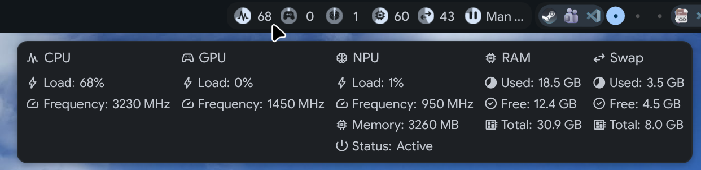

# GPU & NPU Monitoring

Real-time GPU and NPU usage indicators for Intel Lunar Lake SoCs in the QuickShell status bar.



## Features

- **GPU Monitoring**: DRM cycle counter monitoring via `/proc/*/fdinfo/*`
  - Render, video, and compute engine tracking
  - Live GPU frequency display in popup
  - Works with Intel Xe driver (Lunar Lake) and i915
  - Material Symbol icon: `stadia_controller`
- **NPU Monitoring**: True compute utilization via `npu_busy_time_us` sysfs
  - Delta-based % load (nputop-style), not just active/suspended
  - Live frequency and memory usage in popup
  - Material Symbol icon: `neurology`
- **UI Components**: Bar indicator, vertical bar, popup tooltip, and full overlay
- **Configurable thresholds**: Warning colors at 90% usage (customizable)
- **Always-show option**: Keep indicators visible even at 0% usage
- Indicator order: CPU → GPU → NPU → Memory → Swap

## Files

| File | Description |
|------|-------------|
| `services/ResourceUsage.qml` | GPU/NPU monitoring logic with DRM fdinfo parsing |
| `modules/ii/bar/Resources.qml` | GPU/NPU indicators in horizontal bar |
| `modules/ii/verticalBar/Resources.qml` | GPU/NPU indicators in vertical bar |
| `modules/ii/bar/ResourcesPopup.qml` | GPU/NPU info in hover tooltip |
| `modules/ii/overlay/resources/Resources.qml` | GPU/NPU tabs with usage graphs |
| `modules/common/Config.qml` | Configuration options (thresholds, always-show) |

All paths are relative to `dots/.config/quickshell/ii/`.

## Dependencies

```bash
# Arch Linux
sudo pacman -S intel-gpu-tools  # Optional, for intel_gpu_top fallback

# Fedora/RHEL
sudo dnf install intel-gpu-tools

# Ubuntu/Debian
sudo apt install intel-gpu-tools
```

NPU monitoring requires no extra packages — it reads directly from sysfs (`/sys/class/accel/`).

## Configuration

Edit `~/.config/illogical-impulse/config.json`:

```json
{
  "alwaysShowGpu": true,
  "gpuWarningThreshold": 90,
  "alwaysShowNpu": true,
  "npuWarningThreshold": 90
}
```

## How It Works

**GPU**:
1. Reads DRM file descriptors from `/proc/*/fdinfo/*`
2. Parses cycle counters: `drm-cycles-rcs` (render), `drm-cycles-vcs` (video), `drm-cycles-ccs` (compute)
3. Calculates usage: `(active_cycles_delta / total_cycles_delta) * 100`
4. Averages across all active engines

**NPU**:
1. Reads `npu_busy_time_us` and computes utilization from deltas over time
2. Reads runtime power state (`active`/`suspended`) from sysfs
3. Reads current NPU frequency and memory usage for popup detail rows

## Troubleshooting

**GPU shows 0% constantly**:
- Check kernel driver: `lspci -k | grep -A 3 VGA`
- Verify fdinfo exists: `ls /proc/*/fdinfo/* | head`
- Test manually: `cat /proc/$(pgrep -n qs)/fdinfo/* | grep drm-cycles`

**NPU not detected**:
- Check device exists: `ls /sys/class/accel/`
- Verify NPU driver loaded: `lsmod | grep intel_vpu`
- Check dmesg: `dmesg | grep -i npu`

**Permission errors**:
- `/proc/*/fdinfo/` requires process ownership (QuickShell reads its own)
- `/sys/class/accel/` should be world-readable
