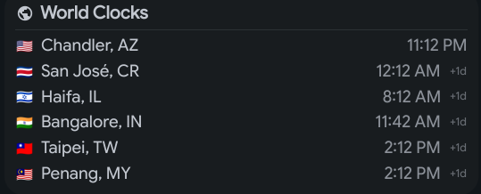

# US Date Format & World Clocks

US-style date formatting in the top bar and a world clocks widget in the right sidebar.




## Features

### Top Bar
- **US date format**: `MM/dd` instead of `dd/MM`
- **ISO work week number**: Shows `W10` next to the date

### Right Sidebar — World Clocks
- Multiple time zones sorted by UTC offset
- Consistent "City, XX" label format
- Shows current time, UTC offset, and day difference relative to local time
- Updates in real time

## Files

| File | Description |
|------|-------------|
| `modules/common/Config.qml` | Date format strings |
| `modules/ii/bar/ClockWidget.qml` | Work week display |
| `modules/ii/sidebarRight/SidebarRightContent.qml` | World clocks integration |
| `modules/ii/sidebarRight/WorldClocks.qml` | World clocks widget (new) |
| `services/DateTime.qml` | `workWeek` property and date formatting |

All paths relative to `dots/.config/quickshell/ii/`.

## Date Format Changes

| Format | Default (EU) | Custom (US) |
|--------|-------------|-------------|
| Top bar date | `ddd, dd/MM` | `ddd, MM/dd` |
| Short date | `dd/MM` | `MM/dd` |
| Date with year | `dd/MM/yyyy` | `MM/dd/yyyy` |

## Configured Time Zones

| City | Time Zone |
|------|-----------|
| London, UK | Europe/London |
| Gdansk, PL | Europe/Warsaw |
| Bangalore, IN | Asia/Kolkata |
| Penang, MY | Asia/Kuala_Lumpur |
| Shanghai, CN | Asia/Shanghai |

## Important: config.json Override

QuickShell persists user settings to `~/.config/illogical-impulse/config.json`.
Changes to `Config.qml` only set **defaults** — the JSON file overrides them at runtime.

To apply date format changes, update the `time` section in `config.json`:

```json
{
  "time": {
    "dateFormat": "ddd, MM/dd",
    "shortDateFormat": "MM/dd",
    "dateWithYearFormat": "MM/dd/yyyy"
  }
}
```

The TUI (`apply-custom.sh`) handles this automatically when the date format feature is enabled.
