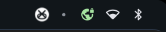

# VPN Status Indicator

Real-time VPN connection indicator in the QuickShell status bar with click-to-toggle.



## Features

- **Visual indicator**: `vpn_lock` Material Symbol icon in the system tray
  - Green when connected
  - Grey when disconnected
- **Click to toggle**: Runs VPN toggle script on click
- **Multiple VPN support**: Detects WireGuard kernel interface, OpenVPN, or tun0
- **Real-time monitoring**: Polls every 5 seconds, refreshes 2s after toggle
- **Configurable**: Toggle script path set via `config.json`

## Files

| File | Description |
|------|-------------|
| `services/VpnStatus.qml` | VPN status monitoring service (new) |
| `modules/ii/bar/BarContent.qml` | Bar integration (MouseArea + icon) |
| `modules/common/Config.qml` | Config option for toggle script path |

All paths are relative to `dots/.config/quickshell/ii/`.

## Requirements

- A VPN toggle script (set via `vpn.toggleScript`)
- One of: WireGuard, OpenVPN, or any VPN creating a tun0 interface

See also: [WireGuard toggle example setup](vpn-toggle-wireguard-example.md)

## Configuration

Edit `~/.config/illogical-impulse/config.json`:

```json
{
  "vpn": {
    "toggleScript": "~/.config/hypr/custom/scripts/vpn_toggle.sh"
  }
}
```

## How It Works

`VpnStatus.qml`:
1. Checks for WireGuard interfaces via `ip link show type wireguard`
2. Falls back to checking for OpenVPN processes and tun0 interface
3. Updates the `connected` property based on findings
4. `toggleVpn()` executes the configured toggle script
5. Status refreshes automatically 2 seconds after toggle

## Customization

Edit `VpnStatus.qml` to adjust:
- Check interval (default: 5000ms)
- VPN detection command
- Toggle script path
- Indicator color (default: green `#4CAF50`)

## Bar Integration

The indicator is placed near other system tray icons in `BarContent.qml`:

```qml
MouseArea {
    Layout.fillHeight: true
    implicitWidth: vpnIcon.implicitWidth
    cursorShape: Qt.PointingHandCursor
    onClicked: VpnStatus.toggleVpn()

    MaterialSymbol {
        text: VpnStatus.materialSymbol
        fill: VpnStatus.symbolFill
        color: VpnStatus.connected ? VpnStatus.indicatorColor : colText
    }
}
```
